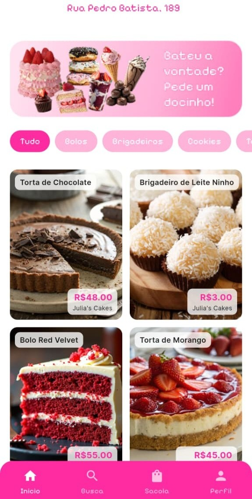
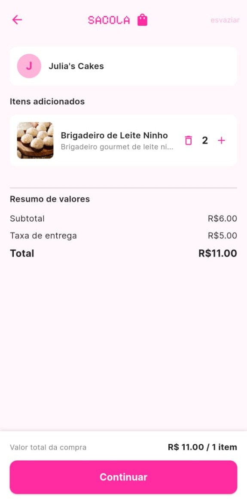
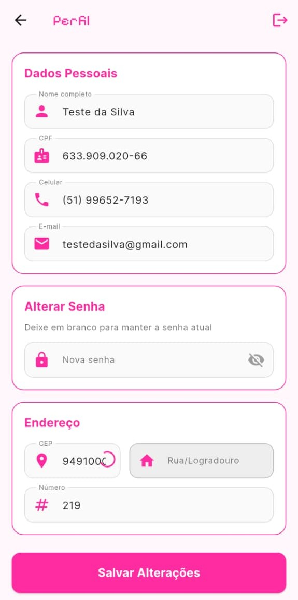
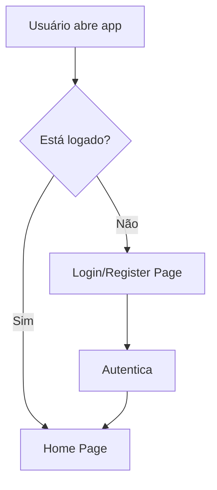
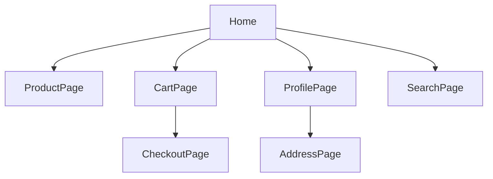

## QueroDoce

QueroDoce é um aplicativo para facilitar a compra de doces, conectando clientes a empresas de confeitaria. O projeto foi desenvolvido em Flutter, com suporte para Android, iOS, Web, Windows, Linux e macOS. 

*O desenvolvimento desse projeto ainda está em andamento!*

<p align="center">
	
</p>

---

## Índice

1. [Visão Geral](#visao-geral)
2. [Estrutura do Projeto](#estrutura-do-projeto)
3. [Instalação e Execução](#instalacao-e-execucao)
4. [Fluxo Principal](#fluxo-principal)
5. [Controllers](#controllers)
6. [Models](#models)
7. [Pages](#pages)
8. [Services](#services)
9. [Widgets](#widgets)
10. [Diagramas](#diagramas)

---

## 1. Visão Geral

O QueroDoce permite que usuários naveguem por produtos, adicionem itens ao carrinho, realizem cadastro/login, finalizem compras e acompanhem pedidos. Empresas podem cadastrar seus produtos e gerenciar vendas.

## Screenshots

Confira abaixo as principais telas do QueroDoce, apresentadas em uma galeria visual. Cada imagem ilustra uma funcionalidade essencial do aplicativo:

<div align="center">

|                       |                    |                        |
| :----------------------------------------------------------: | :--------------------------------------------------------: | :-------------------------------------------------------: |
| **Tela Inicial**<br>Apresenta a marca e opções de navegação. | **Tela de Login**<br>Permite login ou cadastro de usuário. | **Tela Home**<br>Exibe produtos em destaque e categorias. |

|               |                               |                        |
| :----------------------------------------------------: | :---------------------------------------------------------------------: | :---------------------------------------------------------------: |
| **Tela de Busca**<br>Pesquisa de produtos ou empresas. | **Tela do Carrinho**<br>Visualização dos itens e finalização da compra. | **Tela de Perfil**<br>Visualização e edição dos dados do usuário. |

</div>

## 2. Estrutura do Projeto

```
lib/
	main.dart                # Ponto de entrada do app
	register.dart            # Tela de cadastro
	controllers/             # Lógica de negócio e manipulação de dados
	models/                  # Estruturas de dados (entidades)
	pages/                   # Telas do aplicativo
	services/                # Serviços (ex: autenticação)
	widgets/                 # Componentes reutilizáveis
android/, ios/, web/, windows/, linux/, macos/  # Plataformas suportadas
assets/                    # Imagens e fontes
test/                      # Testes automatizados
```

## 3. Instalação e Execução

### Pré-requisitos

- Flutter instalado ([Guia oficial](https://docs.flutter.dev/get-started/install))
- Dart SDK

### Instalação

```sh
git clone https://github.com/aloneinthecityy/QueroDoce.git
cd QueroDoce
flutter pub get
```

### Execução

Para rodar no emulador ou dispositivo:

```sh
flutter run
```

Para rodar testes:

```sh
flutter test
```

## 4. Fluxo Principal

- `main.dart`: Inicializa o app, configura rotas e tema.
- `register.dart`: Tela de cadastro de usuário/empresa.
- Navegação entre páginas via `Navigator`.
- Autenticação via `auth_service.dart`.
- Manipulação de carrinho, produtos e pedidos via controllers.

## 5. Controllers

Localizados em `lib/controllers/`, cada controller gerencia uma parte do app:

- `banner_controller.dart`: Gerencia banners promocionais.
- `carrinho_controller.dart`: Lida com itens do carrinho, adicionar/remover produtos.
- `categoria_controller.dart`: Gerencia categorias de produtos.
- `empresa_controller.dart`: Manipula dados das empresas cadastradas.
- `pessoa_controller.dart`: Gerencia dados dos usuários.
- `produto_controller.dart`: Controla produtos disponíveis para venda.

## 6. Models

Localizados em `lib/models/`, representam entidades do sistema:

- `banner.dart`: Estrutura de banners.
- `carrinho_item.dart`: Item do carrinho.
- `categoria.dart`: Categoria de produto.
- `empresa.dart`: Dados da empresa.
- `pessoa.dart`: Dados do usuário.
- `produto.dart`: Produto disponível.

## 7. Pages

Localizadas em `lib/pages/`, cada arquivo representa uma tela:

- `address_page.dart`: Cadastro/endereço do usuário.
- `cart_page.dart`: Visualização do carrinho.
- `checkout_page.dart`: Finalização da compra.
- `forgot_password_page.dart`: Recuperação de senha.
- `home_page.dart`: Página inicial.
- `product_page.dart`: Detalhes do produto.
- `profile_page.dart`: Perfil do usuário.
- `search_page.dart`: Busca de produtos.

## 8. Services

Localizados em `lib/services/`:

- `auth_service.dart`: Gerencia autenticação, login, logout e cadastro.

## 9. Widgets

Localizados em `lib/widgets/`, são componentes reutilizáveis usados nas páginas, como botões customizados, cards de produto, banners, etc.

## 10. Diagramas

### Diagrama de Fluxo de Autenticação



### Diagrama de Navegação



---

## Exemplos de Uso

### Cadastro de Usuário

1. Usuário acessa `register.dart`.
2. Preenche dados e envia.
3. `pessoa_controller.dart` salva dados.
4. Redireciona para `home_page.dart`.

### Adição ao Carrinho

1. Usuário navega em `product_page.dart`.
2. Seleciona produto e adiciona ao carrinho.
3. `carrinho_controller.dart` atualiza lista de itens.
4. Visualiza em `cart_page.dart`.

### Checkout

1. Usuário acessa `cart_page.dart`.
2. Clica em finalizar compra.
3. `checkout_page.dart` processa pedido.
4. Confirmação exibida.

---

## Contribuição

Sinta-se livre para abrir issues ou pull requests!

---

## Licença

Este projeto está sob a licença MIT.
